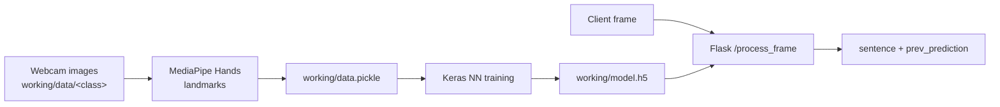

# HandSign

A Flask API that recognizes hand signs from webcam frames using MediaPipe hand landmarks and a Keras neural network.

## Overview

HandSign is a small end-to-end pipeline for sign recognition: collect images of each hand sign from a webcam, turn them into normalized hand-landmark features with MediaPipe, train a feed-forward classifier with TensorFlow/Keras, and serve predictions over a REST API. A client streams frames to the API, which returns the running "sentence" of recognized signs. It was built as a step toward real-time sign language recognition for accessibility.

## Key features

- **Webcam data collection** - captures `dataset_size` (100) images per class into `working/data/<class>/`.
- **Landmark features** - MediaPipe Hands extracts 21 (x, y) landmarks per hand, supports up to 2 hands, and normalizes coordinates relative to the hand's minimum x/y.
- **Neural network classifier** - Dense 256 -> 128 -> 64 with BatchNorm and Dropout (0.3), softmax output; trained for 50 epochs and evaluated on accuracy, precision, recall and AUC.
- **REST API** - Flask endpoints to create the dataset, train the model and classify a frame.
- **Sentence building** - a sign is appended to the sentence only when the prediction changes, so holding a sign does not repeat it.

## Tech stack

Python, Flask, TensorFlow / Keras, MediaPipe, OpenCV, scikit-learn, NumPy.

## How it works



### API endpoints (`API_Hands.py`, port 6969)

| Method | Route | Description |
|---|---|---|
| POST | `/test_connection` | Health check |
| POST | `/create_dataset` | Extract landmarks from `working/data` into `working/data.pickle` |
| POST | `/train_model` | Train the network and save `working/model.h5` |
| POST | `/process_frame` | Classify one frame and update the sentence |

`/process_frame` expects JSON:

```json
{
  "frame": [/* flattened RGB uint8 pixel values */],
  "width": 720,
  "height": 1280,
  "sentence": "",
  "prev_prediction": ""
}
```

The frame is reshaped to `(width, height, 3)`, so for a 720p webcam frame pass `width=720` (rows) and `height=1280` (columns), as `API_Hands_req.py` does. The response is `{"sentence": ..., "prev_prediction": ...}`. The label names are set by `labels_dict` in `API_Hands.py`; edit it to match your classes.

## Repository structure

```
HandSign/
├── API_Hands.py              # Flask API server
├── API_Hands_req.py          # Webcam client that streams frames to the API
├── buildapimodel.py          # Build dataset + train model from the command line
├── hands_package/
│   ├── Build_Model_nn.py     # Data collection, feature extraction, Keras model (used by the API)
│   └── Build_Model.py        # Earlier single-hand RandomForest version
├── tesht.py                  # Local webcam test using Build_Model.py (no API)
├── cropped_test.ipynb        # Scratch notebook: API client and frame cropping experiments
├── working/
│   ├── data.pickle           # Extracted landmark features
│   └── model.h5              # Trained model
└── requirements.txt
```

## Getting started

Requires Python 3.8+ and a webcam.

```bash
git clone https://github.com/DJCodesStuff/HandSign.git
cd HandSign
python -m venv venv && source venv/bin/activate
pip install -r requirements.txt requests
```

`requests` is only needed by the client script.

1. **Collect images and train.** The raw images in `working/data/` are not committed. To record your own, uncomment `model.collecting_data()` in `buildapimodel.py`, then run:

   ```bash
   python buildapimodel.py
   ```

   For each class, a webcam window opens; press `Q` when you are ready and hold the sign while 100 frames are captured. The number of classes is `number_of_classes` in `hands_package/Build_Model_nn.py` (3 by default, or 26 if `working/data` already has 26 class folders). The script then writes `working/data.pickle` and `working/model.h5`.

2. **Start the API.**

   ```bash
   python API_Hands.py
   ```

3. **Stream frames from your webcam.**

   ```bash
   python API_Hands_req.py
   ```

   The client sends 100 frames to `http://127.0.0.1:6969/process_frame` and prints the growing sentence.

## Author

**Dhruv Joshi** - [GitHub](https://github.com/DJCodesStuff) | [Portfolio](https://djcodesstuff.github.io/)
